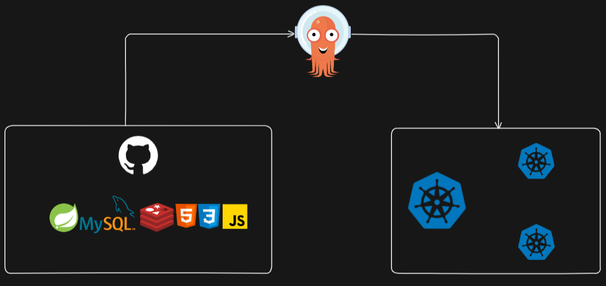
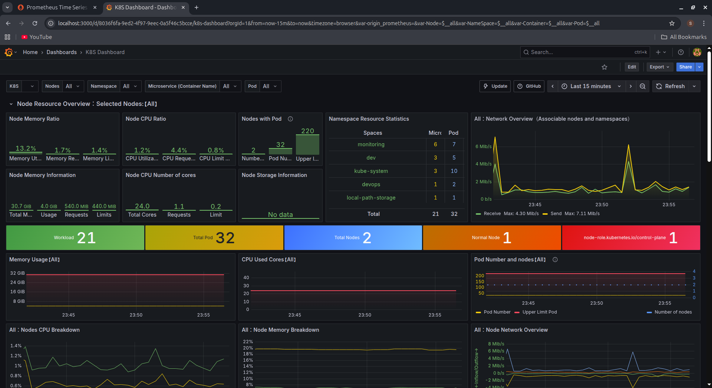

# Spring Boot Application with MySQL and Redis

## Overview
This project is a full-stack Spring Boot application with a frontend built using HTML, CSS, and JavaScript, backed by MySQL database and Redis for caching to improve performance. The application is containerized using Docker and can be deployed on Kubernetes clusters.

## Architecture


The application follows a typical three-tier architecture:
- **Frontend:** HTML/CSS/JavaScript client
- **Backend:** Spring Boot application
- **Database:** MySQL with Redis caching layer

## Kubernetes Dashboard

*Complete cluster overview showing pod health, deployment status, and resource utilization across nodes*

## Prerequisites
Before running this application, ensure you have one of the following setups:

### For Docker Compose deployment:
- Docker and Docker Compose
- Maven (for building the application)
- Git

### For Kubernetes deployment:
- Kubernetes cluster (Minikube, Kind, or cloud-based)
- kubectl (for Kubernetes deployment)
- Git

## Quick Start (Docker Compose)
If you have Maven installed and prefer to run the application locally:

```bash
# Clone the repository
git clone https://github.com/SoniyaKothari/k8s-springboot-mysql-redis-app.git
cd k8s-springboot-mysql-redis-app

# Build the application using Maven
mvn clean package

# Start all services with Docker Compose
docker-compose up -d
```

This command will:
- Build the Spring Boot application JAR file
- Start MySQL database container
- Start Redis container
- Start the Spring Boot application container
- Make the application available at http://localhost:8080

## Quick Start (Kubernetes)
For production deployment on Kubernetes:

```bash
# Clone the repository
git clone https://github.com/SoniyaKothari/k8s-springboot-mysql-redis-app.git
cd k8s-springboot-mysql-redis-app

# Deploy the application to Kubernetes
kubectl apply -f k8s/
```

This command will:
- Create MySQL deployment and service
- Create Redis deployment and service
- Create Spring Boot application deployment and service

## Accessing the Application in Kubernetes
After deploying to Kubernetes, you can access the application using port forwarding:

```bash
# Port forward to access the Spring Boot application
kubectl port-forward service/app-svc 8080:8080 &
```

This will make the application available at [http://localhost:8080](http://localhost:8080)

To access the app directly: [http://localhost:8080/index.html](http://localhost:8080/index.html)  

## Application Features
- **User Management:** CRUD operations for user data
- **High Performance:** Redis caching for frequently accessed data
- **RESTful API:** Clean API endpoints for frontend-backend communication
- **Responsive UI:** Modern web interface built with JavaScript
- **Multiple Deployment Options:** Docker Compose for development, Kubernetes for production

---

**Author:** Soniya Kothari
